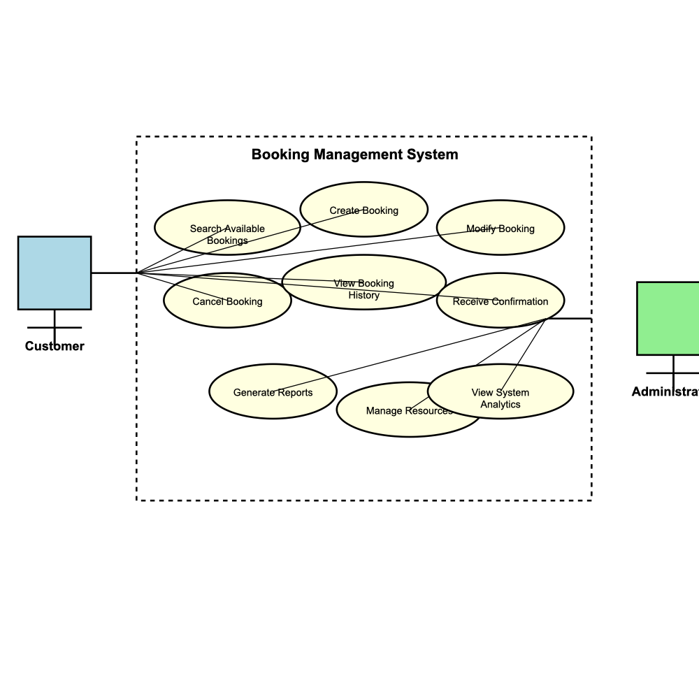

# Requirement Analysis in Software Development

This repository provides concise learning materials and practical resources for performing requirement analysis in software projects. It covers key activities such as eliciting, documenting, validating, and managing requirements, and includes notes, templates (e.g., SRS, user stories, use cases), checklists, and example artifacts to support effective analysis throughout the SDLC.

This are my notes made while following the ALX Course on FrontEnd Development Pro.

## What is Requirement Analysis?

Requirement Analysis is the systematic process of discovering, analyzing, documenting, validating, and managing the needs and constraints of stakeholders for a software system. Its goal is to ensure a shared, testable understanding of what the system must do and the conditions under which it must operate before (and during) design and implementation.

Key activities typically include:
- Elicitation: Engage stakeholders through interviews, workshops, observation, surveys, and analysis of existing systems.
- Analysis and modeling: Clarify, structure, and prioritize requirements; model with use cases, user stories, workflows, and domain models.
- Specification: Document functional and non-functional requirements in artifacts such as an SRS, user stories with acceptance criteria, and use-case specifications.
- Validation: Review and verify requirements with stakeholders to ensure correctness, completeness, consistency, and feasibility.
- Management and traceability: Control changes, maintain a single source of truth, and trace requirements to design, implementation, and tests.

Why it is important in the SDLC:
- Reduces rework and scope creep by clarifying expectations early and controlling changes.
- Aligns stakeholders by establishing a common language and shared understanding of outcomes.
- Improves planning and estimation by clarifying scope, complexity, and constraints.
- Drives architecture and design decisions by highlighting quality attributes (e.g., performance, security, scalability).
- Increases quality and testability by making requirements verifiable and traceable to test cases.
- Mitigates risks and supports compliance by uncovering constraints (legal, regulatory, operational) before costly development work.

Common deliverables:
- Software Requirements Specification (SRS)
- User stories and acceptance criteria
- Use-case diagrams and scenarios
- Prototypes or wireframes
- Requirements traceability matrix

When performed:
- Inception and planning: define vision, scope, and high-level needs
- Elaboration and design: refine, model, and validate requirements; manage changes
- Implementation and testing: maintain traceability to code and tests; refine details
- Deployment and maintenance: manage evolving requirements and feedback from production

## Why is Requirement Analysis Important?

Good software rarely happens by accident. Requirement Analysis gives teams a shared map of what to build and why, before they spend time and money writing code. A few reasons it matters so much in the SDLC:

- Clarity and alignment: It turns scattered ideas into clear, testable expectations. Stakeholders, designers, and engineers can all point to the same source of truth and agree on what “done” really means.

- Risk and cost control: The cheapest time to catch misunderstandings is at the start. By validating needs early, teams avoid scope creep, rework, and late surprises that blow up timelines and budgets.

- Better architecture and quality: Understanding performance, security, compliance, and scalability requirements upfront guides sound architectural choices. This leads to systems that are not just functional, but robust under real-world constraints.

- Testability and transparency: Well‑written requirements translate naturally into acceptance criteria and test cases. This tightens feedback loops, improves coverage, and makes progress visible to non-technical stakeholders.

- Sustainable change: As needs evolve, managed requirements and traceability make it possible to assess impact quickly, prioritize with confidence, and update plans without chaos.

## Key Activities in Requirement Analysis

- Requirement Gathering:
  - Identify stakeholders (users, sponsors, domain experts, operations, compliance) and existing artifacts (legacy systems, manuals, policies).
  - Establish the project context: goals, scope, constraints, dependencies, and success measures.
  - Capture high-level needs and business outcomes before diving into details.

- Requirement Elicitation:
  - Use interviews, workshops, observation, surveys, document analysis, and prototyping to uncover needs.
  - Ask probing questions to reveal implicit expectations, constraints, and edge cases.
  - Resolve conflicting viewpoints and prioritize what delivers the most value.

- Requirement Documentation:
  - Record functional and non-functional requirements clearly and unambiguously.
  - Use artifacts such as an SRS, user stories with acceptance criteria, use cases, and process flows.
  - Maintain a single source of truth that is versioned, searchable, and accessible to all stakeholders.

- Requirement Analysis and Modeling:
  - Structure and refine requirements, remove ambiguity, and check completeness and consistency.
  - Model behavior and data using use-case diagrams, sequence diagrams, state machines, domain models, and wireframes.
  - Prioritize and decompose requirements into implementable units that align with roadmap and capacity.

- Requirement Validation:
  - Review requirements with stakeholders to verify correctness, feasibility, and testability.
  - Define acceptance criteria and link requirements to test cases for traceability.
  - Pilot or prototype critical flows to de-risk assumptions before full implementation.

## Types of Requirements

### Functional Requirements

Functional requirements describe what the system must do—the specific behaviors, features, and functions it should perform. They define the capabilities and operations that users can execute, often expressed in terms of inputs, processes, and outputs.

**Examples for a Booking Management System:**
- The system shall allow users to search for available bookings by date, time, and resource type.
- The system shall enable users to create a new booking by selecting a date, time slot, and resource (e.g., meeting room, equipment, service).
- The system shall validate booking availability in real-time before confirming a reservation.
- The system shall send automated email confirmations to users upon successful booking creation.
- The system shall allow users to view their booking history, including past, current, and upcoming reservations.
- The system shall support booking modification (change date, time, or resource) and cancellation within allowed timeframes.
- The system shall generate booking reports for administrators, showing occupancy rates, popular time slots, and revenue summaries.
- The system shall enforce booking rules such as maximum duration per slot, minimum advance notice, and blackout dates.

### Non-functional Requirements

Non-functional requirements specify how well the system should perform, rather than what it does. They cover quality attributes like performance, security, usability, reliability, and scalability that affect the user experience and system behavior under various conditions.

**Examples for a Booking Management System:**
- **Performance:** The system shall respond to booking search queries within 2 seconds under normal load conditions.
- **Security:** The system shall encrypt sensitive user data (personal information, payment details) using industry-standard encryption (AES-256) both in transit and at rest.
- **Usability:** The system shall be accessible via web and mobile interfaces, and support users with screen readers (WCAG 2.1 AA compliance).
- **Reliability:** The system shall maintain 99.5% uptime, with scheduled maintenance windows communicated 48 hours in advance.
- **Scalability:** The system shall handle up to 10,000 concurrent users and process 1,000 bookings per minute during peak hours.
- **Compatibility:** The system shall work on modern browsers (Chrome, Firefox, Safari, Edge) released within the last two major versions, and on iOS 14+ and Android 10+ devices.
- **Maintainability:** The system codebase shall follow documented coding standards and include automated test coverage of at least 80% for critical booking workflows.
- **Data integrity:** The system shall prevent double-booking conflicts by implementing optimistic locking and transaction management for concurrent booking requests.

## Use Case Diagrams

Use Case Diagrams are visual representations that illustrate the interactions between actors (users, systems, or external entities) and a system's functionality. They model the system's behavior from a user's perspective, showing what actions users can perform and which actors are involved in each interaction.

### Benefits of Use Case Diagrams

- **Clear Communication:** They provide a visual, easy-to-understand representation of system functionality that stakeholders from technical and non-technical backgrounds can grasp.
- **Requirement Discovery:** Help identify all actors and their interactions with the system, ensuring comprehensive requirement coverage.
- **Scope Definition:** Clearly delineate system boundaries by showing what the system does (use cases) and who uses it (actors).
- **Test Planning:** Serve as a foundation for creating test cases, as each use case represents a scenario that needs testing.
- **Documentation:** Act as living documentation that evolves with the project and can be referenced throughout the SDLC.

### Booking Management System Use Case Diagram

The diagram below shows the use cases for the booking management system, identifying the key actors and their interactions:

**Actors:**
- **Customer:** End users who search for, create, modify, and cancel bookings
- **Administrator:** System administrators who manage resources, generate reports, and oversee the booking system

**Use Cases:**
- Search Available Bookings
- Create Booking
- Modify Booking
- Cancel Booking
- View Booking History
- Receive Booking Confirmation
- Generate Reports
- Manage Resources
- View System Analytics

## Acceptance Criteria

Acceptance Criteria are the specific, testable conditions that a feature or requirement must meet to be considered complete and acceptable by stakeholders. They serve as the definitive checklist that bridges the gap between requirements and implementation, ensuring that what gets built matches what was intended.

### Importance of Acceptance Criteria in Requirement Analysis

- **Eliminate Ambiguity:** They translate high-level requirements into concrete, measurable conditions, removing guesswork about what "done" means.

- **Facilitate Testing:** Well-written acceptance criteria directly inform test case creation, making it clear what scenarios need to be verified.

- **Enable Validation:** Stakeholders can review and approve criteria before development begins, ensuring alignment on expectations and reducing rework.

- **Support Estimation:** Clear criteria help development teams better estimate effort by breaking down features into specific, understandable tasks.

- **Improve Communication:** They provide a common language between business analysts, developers, testers, and product owners, reducing miscommunication.

- **Drive Quality:** By defining success conditions upfront, acceptance criteria help prevent defects and ensure the feature works as intended in real-world scenarios.

### Example: Acceptance Criteria for Checkout Feature

**User Story:** As a customer, I want to complete the checkout process for my selected booking so that I can confirm my reservation and receive a confirmation.

**Acceptance Criteria:**

1. **Payment Information Validation**
   - Given a customer has selected a booking and navigated to checkout
   - When they enter payment information
   - Then the system shall validate:
     - Credit card number format (16 digits, valid Luhn algorithm)
     - Expiration date is in the future
     - CVV code is 3-4 digits
     - Billing address matches credit card address format
   - And display clear error messages for invalid fields
   - And prevent form submission until all payment fields are valid

2. **Booking Confirmation**
   - Given a customer has entered valid payment information and clicked "Complete Booking"
   - When the payment is successfully processed
   - Then the system shall:
     - Create a confirmed booking record in the system
     - Generate a unique booking confirmation number (format: BK-YYYYMMDD-XXXXX)
     - Update resource availability to mark the selected time slot as booked
     - Display a success message with the confirmation number
   - And redirect the customer to a booking confirmation page

3. **Email Confirmation**
   - Given a booking has been successfully completed
   - Then the system shall automatically send an email confirmation to the customer's registered email address
   - And the email shall include:
     - Booking confirmation number
     - Date and time of the booking
     - Resource details (name, location, duration)
     - Total amount charged
     - Cancellation policy and contact information
   - And the email shall be sent within 30 seconds of booking completion

4. **Payment Processing**
   - Given a customer submits the checkout form with valid payment details
   - When the payment gateway responds
   - Then the system shall:
     - Process the payment securely through the integrated payment gateway
     - Handle payment success by completing the booking
     - Handle payment failure by displaying an appropriate error message without creating a booking
     - Not charge the customer if the booking fails after payment processing
   - And all payment transactions shall be logged for audit purposes

5. **Error Handling**
   - Given the system encounters an error during checkout (network failure, payment gateway timeout, database error)
   - Then the system shall:
     - Display a user-friendly error message explaining what went wrong
     - Not create a booking record if payment processing fails
     - Preserve the customer's booking selection and payment form data (excluding sensitive payment details)
     - Provide an option to retry the checkout process
   - And log the error details for technical support

6. **Booking Timeout**
   - Given a customer has selected a booking but has not completed checkout within 15 minutes
   - When they attempt to complete checkout after the timeout period
   - Then the system shall:
     - Check if the selected time slot is still available
     - If available, allow checkout to proceed
     - If no longer available, display a message indicating the slot has been reserved and redirect to search for alternative slots
   - And release any temporary hold on the booking resource

